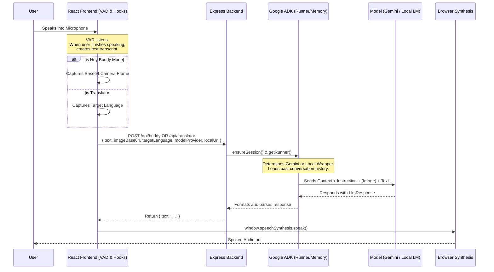

# Visual Assistant

Visual Assistant is an advanced AI companion built using **Google's Agent Development Kit (ADK)** and React. It features two primary applications: **Hey Buddy** (a conversational and vision-based AI companion) and **Live Translator** (a real-time voice translation interface). 

The platform supports both **cloud-based Gemini APIs** (e.g. `gemini-3.1-flash`) and **local LLM providers** (e.g., Ollama running `gemma4`), allowing you to preserve privacy or run offline while still retaining the exact same high-quality user experience.

---

## 🚀 Applications

### 1. Hey Buddy (AI Companion)
An AI companion designed for conversation and vision tasks.
* **Continuous Audio Interaction:** Utilizes the Web Speech API to detect and capture user speech dynamically. When the VAD (Voice Activity Detection) hook (`useSpeechRecognition.ts`) detects a pause in speaking, it immediately captures the transcript. 
* **Vision & Context:** Simultaneously upon speech completion, the camera hook captures a base64-encoded webcam frame. The transcript and the image are packed together giving the model true physical context.
* **Persistent Memory:** Uses the ADK's `InMemorySessionService` to remember conversational turns, ensuring responses are coherent and contextually aware over a long duration.

### 2. Live Translator
A sleek real-time translation module.
* **Live Audio Capture:** Detects user voice using the same VAD (Voice Activity Detection) mechanism and transcribes it instantly.
* **Direct Translation:** Bypasses image capture and asks the LLM purely to translate the transcript into the dynamically selected localized target languages.
* **Native OS Synthesizer:** Reads the translated model response back matching it against your Operating System's native text-to-speech voices to produce human-sounding phonetic pronunciations.

---

## 🔧 Architecture & Data Flow

Visual Assistant relies on an independent Node.js/Express backend that intercepts the frontend's unified payloads, constructs specialized agents on the fly, and routes them through the appropriate ADK pipelines.



### Local Model Support (LM Studio / Ollama)
If the frontend sends `modelProvider: 'local'`, the Express router bypasses standard ADK Gemini execution and utilizes a custom `LocalOpenAILlm` wrapper class extending `BaseLlm`.
It converts ADK request structures into generic OpenAI Chat Completions inputs and routes it natively through your private local instance (defaulting to Ollama at `http://localhost:11434/v1`).

Because the local models receive identical payloads to Gemini, it has **total parity in conversational UI**, rendering offline local processing visually indistinguishable from its remote cloud counterpart.

---

## 🛠 Setup & Installation

### 1. Install Dependencies
```bash
npm install
```

### 2. Environment Variables
Create a `.env` file in the root directory and specify your connections.
```env
# Required for Cloud Access
VITE_GEMINI_API_KEY=your_gemini_3.1_flash_api_key_here

# Backend Server Configuration
PORT=3001

# Local Model Development (Optional Overrides)
# e.g., using Ollama or LMStudio
LOCAL_MODEL_URL=http://localhost:11434/v1
LOCAL_MODEL_NAME=gemma4:e2b
```

### 3. Run the Development Server
This will concurrently start the Vite build server for the React app and `tsx` running the Node/Express backend.
```bash
npm run dev
```

### 4. Hardware Access
Ensure that your web browser has explicitly been granted Camera and Microphone permissions, or the core VAD loop will fail.

### 5. Tech stack
### Key Components
*   **Frontend**: React 19 + Vite 7 (TypeScript)
*   **Backend**: Express + Node.js (via `tsx`)
*   **AI Engine**: [Google Gemini 3.1 Flash](https://aistudio.google.com/) and Gemma 4 (local via Ollama)
*   **Frameworks**: 
    *   **Google ADK**: For agentic workflows and session management.
    *   **Framer Motion**: For fluid, state-driven UI animations.
    *   **TailwindCSS**: For modern, glassmorphic styling.
    *   **Lucide React**: For high-quality iconography.